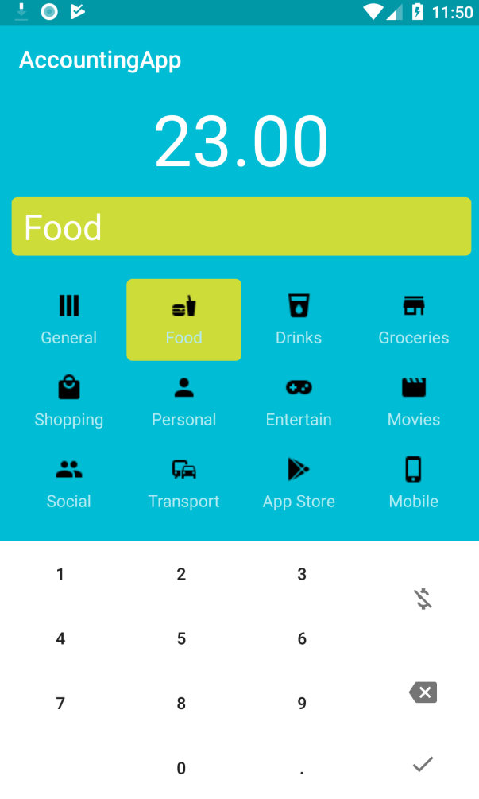
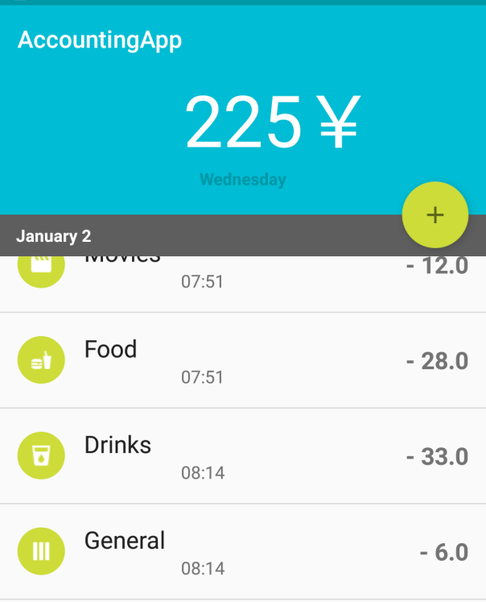

## Pocket book

### Enables logging in, secrecy, and the addition, deletion, and modification of account information.

### and visualization of account data

### Support for viewing accounting data and line management images by month, day of the week, and date

### Using the plugin [ticker](https://github.com/robinhood/ticker)

! [img](readme.assets/ticker_main.gif)

### Its main purpose is to provide elegantly scrolling transitions as the account data changes.

# Pocket-book
